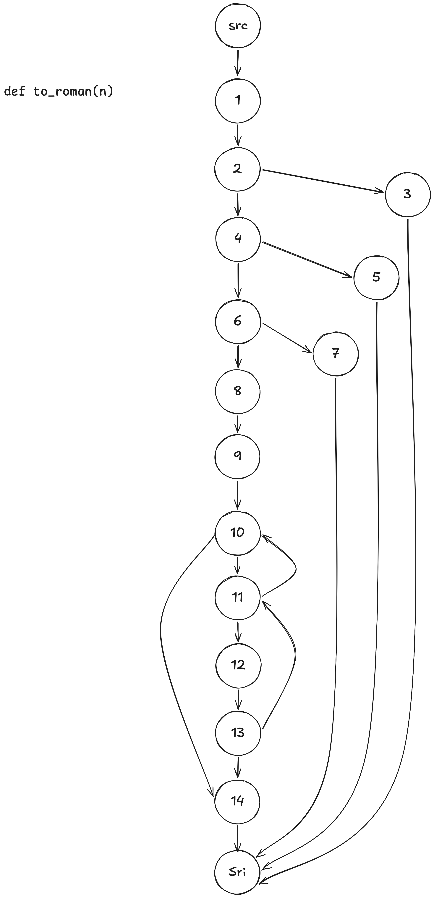
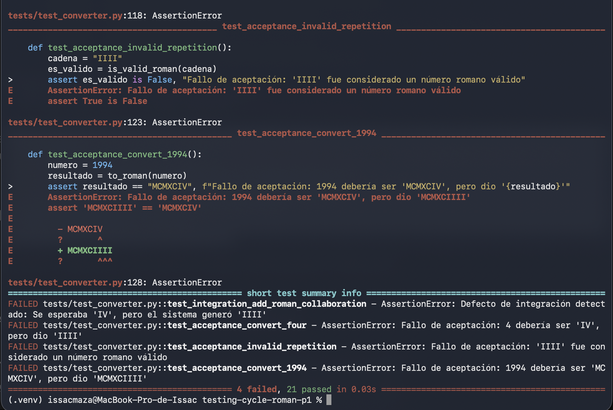

# ISSAC Maza Workshop Report: Testing Life Cycle

---

## 1. Initial Audit and Baseline Coverage (Part 2)
Before modifying or adding code, the legacy test suite was run to verify its functionality and measure the initial branch coverage.

* **Evidence of initial execution (15 tests passed):**
  *(Insert your screenshot of the 15 initial tests here)*
  

* **Evidence of execution of `python -m roman 4 IV 1994` and initial coverage measurement:** Branch coverage was initially **64%**[cite: 1].
    pytest --cov=roman.converter --cov-branch --cov-report=term-missing
    
  
  

## 2. Control Flow Graph and Structural Analysis of `to_roman`

### Control Flow Graph (CFG)

### Cyclomatic Complexity
$$V(G) = E - N + 2$$
* **$E$ (Edges):** 21
* **$N$ (Nodes):** 16
* **$V(G)$:** $21 - 16 + 2 = 7$

### Set of Linearly Independent Paths
* **Path 1:** src → 1 → 3 → Sri
* **Path 2:** src → 1 → 2 → 3 → Sri
* **Path 3:** src → 1 → 2 → 4 → 5 → Sri
* **Path 4:** src → 1 → 2 → 4 → 6 → 7 → Sri
* **Path 5:** src → 1 → 2 → 4 → 6 → 8 → 9 → 10 → 14 → Sri
* **Path 6:** src → 1 → 2 → 4 → 6 → 8 → 9 → 10 → 11 → 10 → 14 → Sri
* **Path 7:** src → 1 → 2 → 4 → 6 → 8 → 9 → 10 → 11 → 12 → 13 → 11 → 10 → 14 → Sri

### Definition-Use (Def-Use) Table
| Variable | Def. Node (Creation) | Use Node | Type of Use |
| :--- | :---: | :---: | :---: |
| **n** | Input (Line 40) | 1 | p-use |
| | | 2 | p-use |
| | | 4 | p-use |
| | | 6 | p-use |
| | | 9 | c-use |
| **out** | 8 | 12 | c-use |
| | | 14 | c-use |
| **remaining** | 9 | 11 | p-use |
| | | 13 | c-use |
| | 13 (Redefinición) | 11 | p-use |
| | | 13 | c-use |
| **value** | 10 | 11 | p-use |
| | | 13 | c-use |
| **symbol** | 10 | 12 | c-use |

---

## 3. Integration Test Findings

* **Defect found:** The `to_roman` function incorrectly outputs `“IIII”` instead of `“IV”` for the number 4, and exhibits similar behavior for other subtractions.
* **Why the unit tests passed without detecting it:** The unit tests covered the code’s logical paths and exceptions individually (achieving 100% branch coverage), but did not evaluate the mathematical and formal accuracy of the converted values.
* **Inter-module coordination issue:** The defect remained hidden because the `from_roman` function is overly permissive in accepting repeated strings such as `“IIII”` without raising exceptions. When such a string is passed to `is_valid_roman`, it returns `True`, masking the logical error in the coordination between modules.

---

## 4. Acceptance Criteria (Given / When / Then)

1. **Criterion 1 (Conversion of 4):**
   * **Given:** I have the integer 4.
   * **When:** I convert it to Roman numerals using `to_roman(4)`.
   * **Then:** The result must be exactly `“IV”`. *(This criterion failed).*

2. **Criterion 2 (Repetition Validation Rule):**
   * **Given:** I have the invalid Roman numeral string `“IIII”`.
   * **When:** I validate its structure with `is_valid_roman(“IIII”)`.
   * **Then:** The system must reject it by returning `False`. *(This criterion failed).*

3. **Criterion 3 (Conversion of 1994):**
   * **Given:** I have the integer 1994.
   * **When:** I convert it to Roman numeral notation using `to_roman(1994)`.
   * **Then:** The result must be `“MCMXCIV”`. *(This criterion failed).*

### Why doesn't code coverage reveal these types of defects?
Branch coverage only guarantees that every instruction and logical decision in the source code has been executed at least once. However, it does not evaluate semantic correctness or the business rules of the specification. Software can have 100% coverage and still be performing operations that are incorrect according to user requirements, making functional acceptance testing essential to detect such issues.

---

## 5. Code Coverage

* **Initial Coverage (Branch Coverage):** 64%

* **Final coverage after unit tests:** 100%

