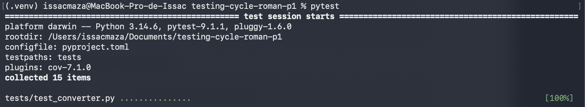
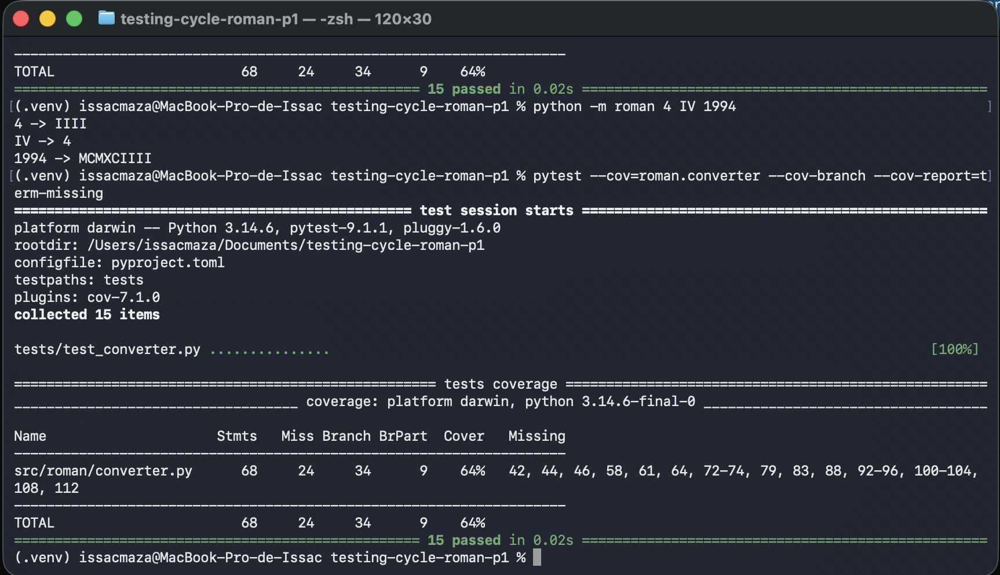
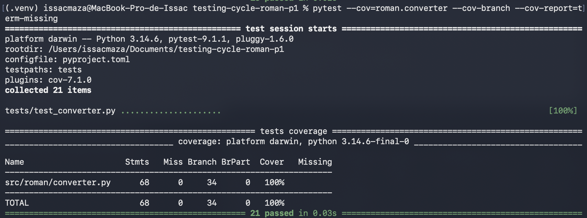
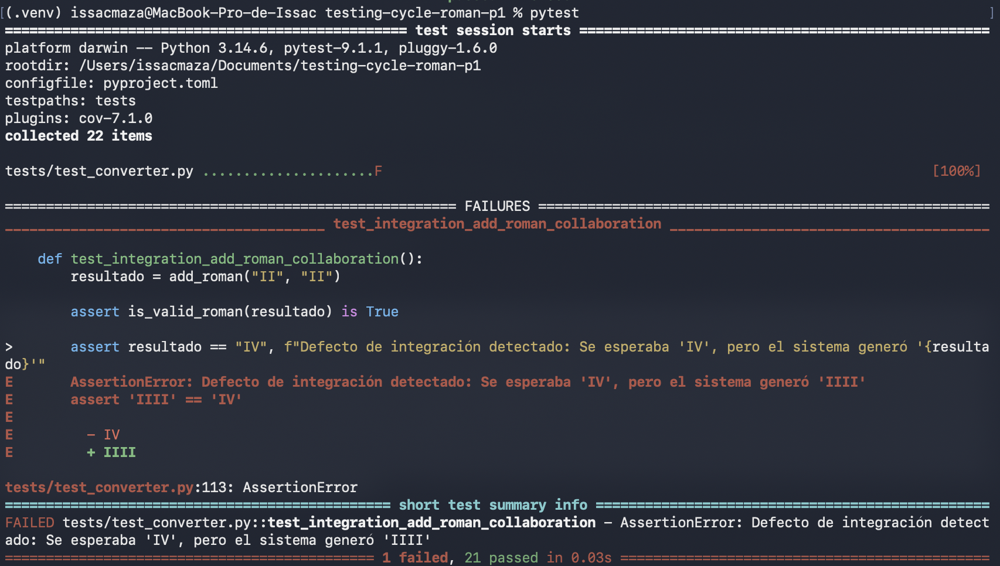
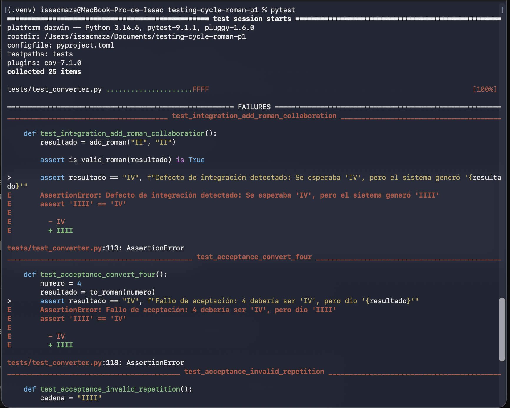
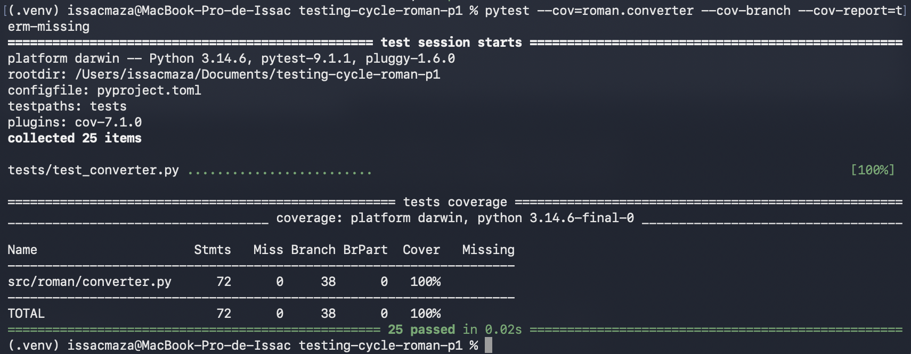

# Reporte de Taller ISSAC Maza: Ciclo de Vida de las Pruebas (Testing Life Cycle)

---

## 1. Auditoría Inicial y Cobertura Base (Parte 2)
Antes de modificar o añadir código, se ejecutó la suite de pruebas heredada para verificar su funcionamiento y medir la cobertura inicial de ramas (*branch coverage*).

* **Evidencia de ejecución inicial (15 pruebas pasadas):**
  *(Inserta aquí tu captura de pantalla de las 15 pruebas iniciales)*
  [cite: 2]

* **Evidencia de ejecucion de python -m roman 4 IV 1994 y Medición de cobertura inicial:** La cobertura de ramas se ubicó inicialmente en el **64%**[cite: 1].
    pytest --cov=roman.converter --cov-branch --cov-report=term-missing
    [cite: 3] 
  
  

## 2. Grafo de Flujo de Control y Análisis Estructural de `to_roman`

### Grafo de Flujo de Control (CFG)
[cite: 4]

### Complejidad Ciclomática
$$V(G) = E - N + 2$$[cite: 2]
* **$E$ (Aristas):** 21[cite: 2]
* **$N$ (Nodos):** 16[cite: 2]
* **$V(G)$:** $21 - 16 + 2 = 7$[cite: 2]

### Conjunto Base de Caminos Linealmente Independientes
* **Camino 1:** src → 1 → 3 → Sri[cite: 2]
* **Camino 2:** src → 1 → 2 → 3 → Sri[cite: 2]
* **Camino 3:** src → 1 → 2 → 4 → 5 → Sri[cite: 2]
* **Camino 4:** src → 1 → 2 → 4 → 6 → 7 → Sri[cite: 2]
* **Camino 5:** src → 1 → 2 → 4 → 6 → 8 → 9 → 10 → 14 → Sri[cite: 2]
* **Camino 6:** src → 1 → 2 → 4 → 6 → 8 → 9 → 10 → 11 → 10 → 14 → Sri[cite: 2]
* **Camino 7:** src → 1 → 2 → 4 → 6 → 8 → 9 → 10 → 11 → 12 → 13 → 11 → 10 → 14 → Sri[cite: 2]

### Tabla de Definición-Uso (Def-Use)
| Variable | Nodo Def. (Creación) | Nodo de Uso | Tipo de Uso |
| :--- | :---: | :---: | :---: |
| **n** | Entrada (Línea 40)[cite: 2] | 1[cite: 2] | p-use[cite: 2] |
| | | 2[cite: 2] | p-use[cite: 2] |
| | | 4[cite: 2] | p-use[cite: 2] |
| | | 6[cite: 2] | p-use[cite: 2] |
| | | 9[cite: 2] | c-use[cite: 2] |
| **out** | 8[cite: 2] | 12[cite: 2] | c-use[cite: 2] |
| | | 14[cite: 2] | c-use[cite: 2] |
| **remaining** | 9[cite: 2] | 11[cite: 2] | p-use[cite: 2] |
| | | 13[cite: 2] | c-use[cite: 2] |
| | 13 (Redefinición)[cite: 2] | 11[cite: 2] | p-use[cite: 2] |
| | | 13[cite: 2] | c-use[cite: 2] |
| **value** | 10[cite: 2] | 11[cite: 2] | p-use[cite: 2] |
| | | 13[cite: 2] | c-use[cite: 2] |
| **symbol** | 10[cite: 2] | 12[cite: 2] | c-use[cite: 2] |

[cite: 5] 
---

## 3. Hallazgo de Integración
[cite: 5] 
* **Defecto revelado:** La función `to_roman` genera incorrectamente `"IIII"` en lugar de `"IV"` para el número 4, y un comportamiento análogo para otras sustracciones.
* **Por qué las pruebas unitarias pasan sin detectarlo:** Las pruebas unitarias cubrieron los caminos lógicos y las excepciones del código de manera individual (alcanzando el 100% de cobertura de ramas), pero no evaluaron la precisión matemática y formal de los valores convertidos.
* **Problema de colaboración:** El defecto se mantuvo oculto porque la función `from_roman` es excesivamente permisiva al aceptar cadenas repetidas como `"IIII"` sin lanzar excepciones. Al pasar dicha cadena por `is_valid_roman`, esta retorna `True`,mascarando el error lógico en la colaboración de módulos.

---

## 4. Criterios de Aceptación (Given / When / Then)

1. **Criterio 1 (Conversión del 4):**
   * **Given:** Tengo el número entero 4.
   * **When:** Lo convierto a notación romana usando `to_roman(4)`.
   * **Then:** El resultado debe ser exactamente `"IV"`. *(Este criterio falló).*

2. **Criterio 2 (Regla de validación de repeticiones):**
   * **Given:** Tengo la cadena romano-inválida `"IIII"`.
   * **When:** Valido su estructura con `is_valid_roman("IIII")`.
   * **Then:** El sistema debe rechazarla retornando `False`. *(Este criterio falló).*

3. **Criterio 3 (Conversión de 1994):**
   * **Given:** Tengo el número entero 1994.
   * **When:** Lo convierto a notación romana usando `to_roman(1994)`.
   * **Then:** El resultado debe ser `"MCMXCIV"`. *(Este criterio falló).*

[cite: 6] 
[cite: 7] 

### ¿Por qué la cobertura de código no revela este tipo de defectos?
La cobertura de ramas (*branch coverage*) garantiza únicamente que cada instrucción y decisión lógica del código fuente ha sido ejecutada al menos una vez. Sin embargo, no evalúa la corrección semántica ni las reglas de negocio de la especificación. Un software puede tener un 100% de cobertura y estar ejecutando operaciones erróneas frente a los requerimientos del usuario, requiriendo obligatoriamente pruebas funcionales de aceptación para detectarlo.

---

## 5. Cobertura de Código

* **Cobertura inicial (Branch Coverage):** 64%[cite: 1]
[cite: 1]
* **Cobertura final post-pruebas unitarias:** 100%
[cite: 8] 

* **Commit each fix separately. State in the message the level of testing that found the defect**
[cite: 8] 

